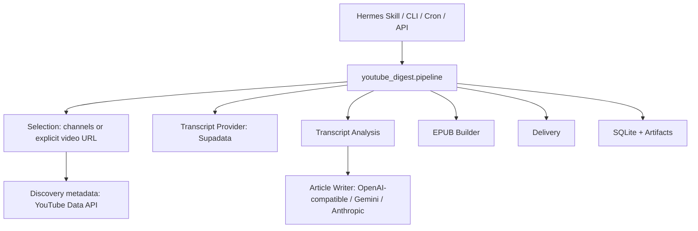

# Architecture

The product boundary is the `youtube_digest` package plus the `youtube-digest`
CLI. Hermes, cron, systemd, dashboards, and future MCP servers should call that
boundary instead of importing internal modules.

Design principles:

- Keep API keys in environment variables or `.env`, never config files.
- Save every intermediate artifact so output can be audited.
- Magazine mode uses an analysis-to-article workflow by default, then checks
  output length and triggers an expansion pass when the draft is too short.
- Default to native transcripts to avoid surprise transcription charges.
- Keep LLM providers pluggable; OpenAI-compatible chat completions are the
  default integration surface.
- Make paid operations explicit and bounded.
- Keep Hermes integration thin; the CLI remains the stable contract.
